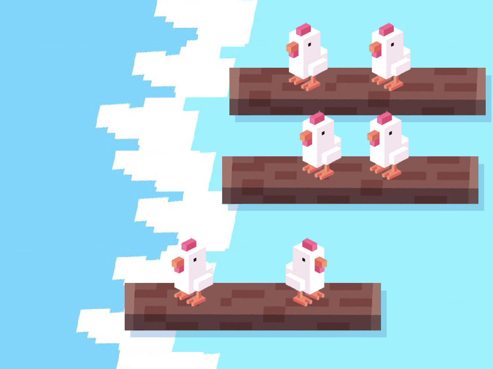

# Les 4 

- Inheritance
- Composition

<Br><Br><Br>

## Inheritance

Dit betekent dat een class automatisch de eigenschappen en functions van een andere class kan overnemen. In dit codevoorbeeld zie je dat de class `Robot` de eigenschappen van een `Actor` krijgt. 

```js
import { Actor } from "excalibur"

class Robot extends Actor {

}
```
Omdat de `Robot` nu een Excalibur `Actor` is, kan je de `onInitialize` functie gebruiken. Ook is er nu een `pos` en `vel` beschikbaar:
```js
import { Actor } from "excalibur"

class Robot extends Actor {
    onInitialize(){
        console.log(this.pos)
        console.log(this.vel)
    }
}
```
### Constructor en super()

Als je in jouw class `extends` gebruikt dan moet je het `super()` keyword toevoegen aan je constructor. Dit zorgt dat de constructor van de parent class ook aangeroepen wordt:

```js
import { Actor } from "excalibur"

class Robot extends Actor {
    constructor() {
        super()
        console.log("ik ben een robot")
    }
}
```
### Super in Excalibur

In Excalibur wordt `super()` gebruikt om de `x,y` en de `width,height` aan de actor class door te geven.
```js
import { Actor } from "excalibur"

class Robot extends Actor {
    constructor() {
        super({x:10, y:10, width:100, height:100})
        console.log("ik ben een robot")
    }
}
```

> *🚨 Als je class geen constructor heeft, dan kan je `super()` ook weglaten.*

<br><br><br>

### Excalibur classes met inheritance

Hieronder nog een aantal voorbeelden waarin je `extends` gebruikt om de functionaliteit van Excalibur aan jouw code toe te voegen.

```js
class Game extends Engine {
}
class MyText extends Label {
}
class MyLoader extends Loader {
}
```

<Br><Br><Br>

## Composition 

Composition houdt in dat je nadenkt over hoe je game is opgebouwd. Zitten al je actors in de main game class, of is het handiger dat een actor zelf ook weer child actors heeft? 

### Code voorbeeld

In dit code voorbeeld plaatsen we een `Car` Actor op een `Road` Actor.

```js
class Road extends Actor {
    onInitialize(){
        let c = new Car()
        this.addChild(c)
    }
}
```
<br>

## Oefening

In de volgende oefening plaatsen we kippen op een boomstam om te oefenen met inheritance en composition. De relaties tussen de classes kan je als diagram tekenen:


- Kip en Boomstam zijn Actors ***(Inheritance)***
- Game is Engine ***(Inheritance)***
- Game heeft Boomstammen ***(Composition)***
- Boomstam heeft kippen ***(Composition)***

<br><br><br>

## 🐔 Chicken on a raft

- Begin met [excalibur chicken on a raft](https://github.com/HR-CMGT/prg4-chicken-on-a-raft)
- Plaats `Tree` in de `Game`
- Plaats `Chicken` op de `Tree`
- Laat de kippen meebewegen met de boomstammen.
- Laat de kippen heen en weer bewegen op de boomstammen
- Geef de kippen een hoedje
- [Speel de theme song](https://www.youtube.com/watch?v=yVihOxP2QeY)

<br>

### Composition

- Om `Actors` toe te voegen aan de `Game` (of aan een `Scene`) gebruik je `this.add()`.
- Om `Actors` toe te voegen aan een andere `Actor` gebruik je `this.addChild()`.

<br>

### Resultaat



<Br><Br><Br>